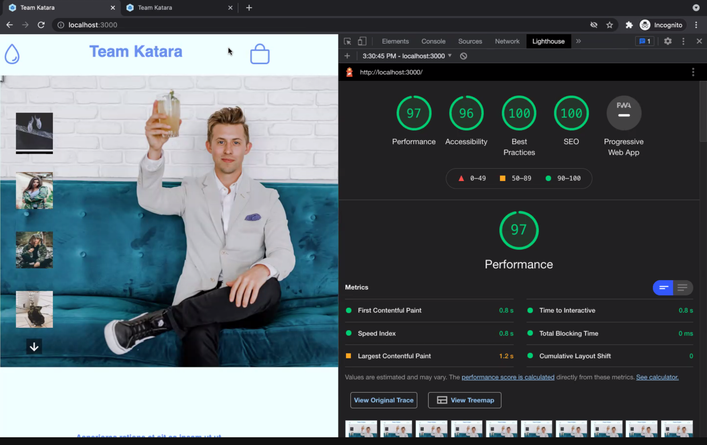
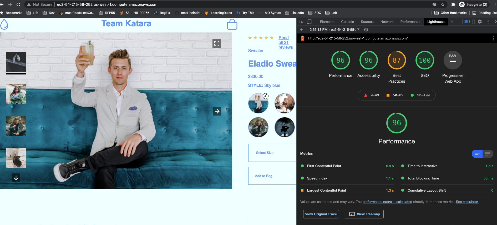

# Project Catwalk - Optimization

## Optimizing Production Code for Deployment

- Step One: Check and make sure webpack.production.config.js is in your local machine repo before running the following command

```bash
npm run build:prod
```

This command will run the team's production config of webpack and minimize bundle.js using TerserPlugin. We have not setup CSSMinimizer at this time, but plan to implement it in the future.

- Step Two: Once webpack has completed bundling you can test the optimized results on your local machine at localhost:3000. (It is ok if you see warnings in the terminal after production bundling.)

- Step Three: Once the webpage has loaded up, open your developer console and run a lighthouse test to see the optimized results for Project Catwalk.

Example Results You should see:



Results on EC2 Instance before configuring the server's security groups to accept HTTPS traffic


<!-- <p align="center">
  
</p> -->

### Methods Used For Optimization

To handle our performance optimization we leaned heavily into [Webpack 5's optimization](https://webpack.js.org/configuration/optimization/). Our team also leveraged [preloading](https://developer.mozilla.org/en-US/docs/Web/HTML/Link_types/preload) to pre-load some of the images that rendered above the fold.
